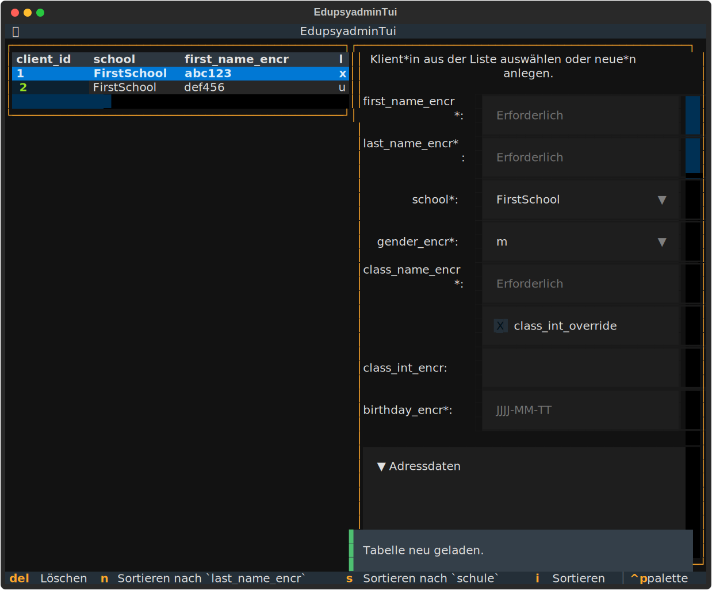

# edupsyadmin

edupsyadmin provides tools to help school psychologists with their
documentation

## Key Features

- **Secure & Encrypted:** Sensitive client data is stored in an encrypted
SQLite database using `cryptography` and `keyring` for secure credential
management.
- **Modern TUI & CLI:** Choose between an intuitive Terminal User Interface
(TUI) for interactive workflows or a powerful Command Line Interface (CLI) for
automation.
- **Automated Documentation:** Automatically fill PDF forms and generate
reports using stored client data.
- **Data Interoperability:** Import student data from common school management
software via CSV exports.

## Basic Setup

You can install the CLI using pip or
[uv](https://docs.astral.sh/uv/getting-started/installation).

Install with uv:

```text
uv tool install edupsyadmin
```

You may get a warning that the `bin` directory is not on your environment path.
If that is the case, copy the path from the warning and add it directory to
your **environment path** permanently or just for the current session.

Run the application:

```text
edupsyadmin --help
```

## Quick Start

The fastest way to get started is by using the interactive **edupsyadmin TUI**:



### 1. Configure the app

First, you have to update the config file with your data using the config
editor TUI:

```text
edupsyadmin edit-config
```

### 2. Launch the main interface

Once configured, you can view, add, and edit clients, as well as fill PDF forms
directly from the main TUI:

```text
edupsyadmin tui
```

## Getting started

### Keyring backend

edupsyadmin uses `keyring` to store the encryption credentials. `keyring` has
several backends.

- On Windows the default is the Windows Credential Manager (German:
  Anmeldeinformationsverwaltung).

- On macOS, the default is Keychain (German: Schlüsselbund)

Those default keyring backends unlock when you login to your machine. You may
want to install a backend that requires separate unlocking:
<https://keyring.readthedocs.io/en/latest/#third-party-backends>

## The database

The information you enter, is stored in an SQLite database with the fields
described [in the documentation for
edupsyadmin](https://edupsyadmin.readthedocs.io/en/latest/clients_model.html#)

## Examples

Get information about the path to the config file and the path to the database:

```text
edupsyadmin info
```

Add a client interactively:

```text
edupsyadmin new-client
```

Add a client to the database from a Webuntis csv export:

```text
edupsyadmin new-client --csv ./path/to/your/file.csv --name "short_name_of_client"
```

Change values for the database entry with `client_id=42` interactively:

```text
edupsyadmin set-client 42
```

Change values for the database entry with `client_id=42` from the command line:

```text
$ edupsyadmin set-client 42 \
  --key_value_pairs \
  "nta_font=1" \
  "nta_zeitv_vieltext=20" \
  "nos_rs=0" \
  "lrst_diagnosis_encr=iLst"
```

Delete the database entry with `client_id=42`:

```text
edupsyadmin delete-client 42
```

See an overview of all clients in the database:

```text
edupsyadmin get-clients
```

Fill a PDF form for the database entry with `client_id=42`:

```text
edupsyadmin create-documentation 42 --form_paths ./path/to/your/file.pdf
```

Fill all files that belong to the form_set `lrst` (as defined in the
config.yml) for the database entry with `client_id=42`:

```text
edupsyadmin create-documentation 42 --form_set lrst
```

Generate a "Tätigkeitsbericht" PDF with 3 Anrechnungsstunden (experimental):

```text
edupsyadmin taetigkeitsbericht 3
```

Flatten filled PDF forms:

```text
edupsyadmin flatten-pdfs ./path/to/filled_form.pdf
```

## Development

Create the development environment:

```text
uv v
uv pip install -e .
```

Run the test suite:

```text
.venv/bin/python -m pytest -v -n auto --cov=src test/
```

Run the benchmarks (set `--benchmark-time-unit=s` to set the unit to seconds)

```text
.venv/bin/python -m pytest --benchmark-only test/
```

Build documentation:

```text
.venv/bin/python -m sphinx -M html docs docs/_build
```

## License

This project is licensed under the terms of the MIT License. Portions of this
project are derived from the python application project cookiecutter template
by Michael Klatt, which is also licensed under the MIT license. See the
LICENSE.txt file for details.
