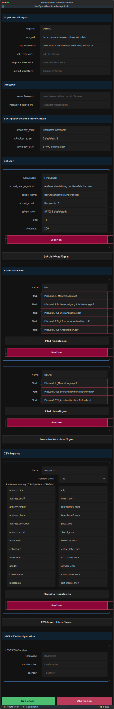

Konfiguration
=============

Nach der Installation ist der nächste Schritt die Konfiguration von
``edupsyadmin``.

Die Konfiguration wird in einer Textdatei (im YAML-Format, einem einfachen
Textformat für Einstellungen) gespeichert. Darin stehen wichtige Einstellungen
wie deine Schulen oder Vorlagen-Sets. Standardmäßig liegt diese Datei unter
``~/.config/edupsyadmin/config.yml``.

.. tip::
   **Pfade zu Ordnern und Dateien kopieren**

   In dieser Konfiguration musst du mehrfach Pfade zu Ordnern oder Dateien
   angeben. So kopierst du einen Pfad:

   .. tab-set::

      .. tab-item:: Windows

         #. Rechtsklick auf die Datei oder den Ordner im Explorer
         #. Wähle "Als Pfad kopieren"
         #. Der Pfad wird mit Anführungszeichen kopiert – diese kannst du
            beim Einfügen entfernen

      .. tab-item:: macOS

         #. Rechtsklick auf den Ordner oder die Datei im Finder
         #. Halte die :kbd:`Alt`-Taste (⌥) gedrückt
         #. Wähle "... als Pfadname kopieren"

      .. tab-item:: Linux

         #. Rechtsklick auf den Ordner oder die Datei im Dateimanager
         #. Wähle "Pfad kopieren" oder "Adresse kopieren"
            (je nach Dateimanager)

         *Hinweis: Die genaue Bezeichnung kann je nach verwendetem
         Dateimanager variieren.*

Wir müssen diese Datei aber nicht von Hand bearbeiten. Starte einfach die
Konfigurations-Oberfläche (Text User Interface, kurz TUI) mit diesem Befehl:

.. code-block:: console

   $ edupsyadmin edit-config

Die Oberfläche, die du jetzt siehst, sollte so aussehen:

Für die meisten Eingabefelder ist in dieser Ansicht eine Erklärung hinterlegt,
die sichtbar wird, wenn du die Maus über den Namen des Feldes bewegst.

Gehen wir die Felder nun Schritt für Schritt durch:

**App-Einstellungen**

#.  **Benutzername**: Ersetze den Platzhalternutzername ``sample.username``
    durch deinen eigenen Benutzernamen. Wähle etwas Kurzes ohne Leerzeichen
    oder Sonderzeichen.
#.  **template_directory**: Pfad zum Ordner, in dem du die leeren
    Formular-Vorlagen abgelegt hast (siehe Tipp oben zum Kopieren von Pfaden).
#.  **output_directory** (optional): Ordner, in dem ausgefüllte Formulare
    standardmäßig gespeichert werden sollen (siehe Tipp oben zum Kopieren von
    Pfaden).

**Passwort**

Lege hier ein sicheres Passwort für die Verschlüsselung fest.

.. tip::
   Du kannst dieses Passwort später jederzeit ändern. ``edupsyadmin``
   unterstützt Schlüssel-Rotation, sodass bestehende Daten weiterhin
   entschlüsselt werden können. Wenn du dein Passwort änderst, empfiehlt
   es sich jedoch, anschließend den Befehl ``edupsyadmin rotate-key``
   auszuführen, um alle Daten in der Datenbank auf das neue Passwort
   zu migrieren.

**Schulpsychologie-Einstellungen**

Hier hinterlegst du deinen Namen und die Adresse deiner Stammschule.

**Schul-Einstellungen**

#.  **Kurzname**: Ändere unter "Einstellungen für Schule 1" den Kurznamen deiner
    Schule zu etwas Einprägsamem wie z.B. ``GS-Muster``. Verwende auch
    hier keine Leerzeichen oder Sonderzeichen.
#.  **Schuldaten**: Fülle die restlichen Informationen für deine Schule aus.
    Besonders das Feld ``end`` ist interessant: Es hilft ``edupsyadmin`` zu
    schätzen, wann die Akten vernichtet werden können (3 Jahre nach dem
    voraussichtlichen Abschluss). Trage hier die typische
    Abgangs-Jahrgangsstufe ein.
#.  **Weitere Schulen**: Wenn du an mehreren Schulen tätig bist, klicke
    einfach auf ``Schule hinzufügen`` und wiederhole die beiden letzten
    Schritte.

**Formular-Sätze (Form Sets)**

Mit Formular-Sätzen (Form Sets) kannst du wiederkehrende Aufgaben
beschleunigen. Ein "Form Set" ist eine Gruppe von PDF-Vorlagen, die du oft
zusammen brauchst (z.B. Anschreiben und Stellungnahme für LRSt). Lösche die
bestehenden Beispiel-Formularsätze und lege ein neues an:

#.  **Beispiel-Set anlegen**: Wir nennen ein Set ``lrst``.

#.  **Vorlagen herunterladen**: Lade dir diese zwei Beispiel-PDFs herunter
    und speichere sie an einem Ort, wo du sie wiederfindest:

    - `sample_form_mantelbogen.pdf`_
    - `sample_form_stellungnahme.pdf`_

#.  **Pfade eintragen**: Kopiere den Pfad zur ersten heruntergeladenen Datei
    (siehe Tipp oben). Füge diesen Pfad in ein Feld unter deinem ``lrst``
    Set ein. Wiederhole das für die zweite Datei.

Abschließend klicke auf **Speichern**, um die Konfiguration zu sichern.

.. _`sample_form_mantelbogen.pdf`: https://github.com/LKirst/edupsyadmin/blob/main/test/edupsyadmin/data/sample_form_mantelbogen.pdf
.. _`sample_form_stellungnahme.pdf`: https://github.com/LKirst/edupsyadmin/blob/main/test/edupsyadmin/data/sample_form_stellungnahme.pdf
